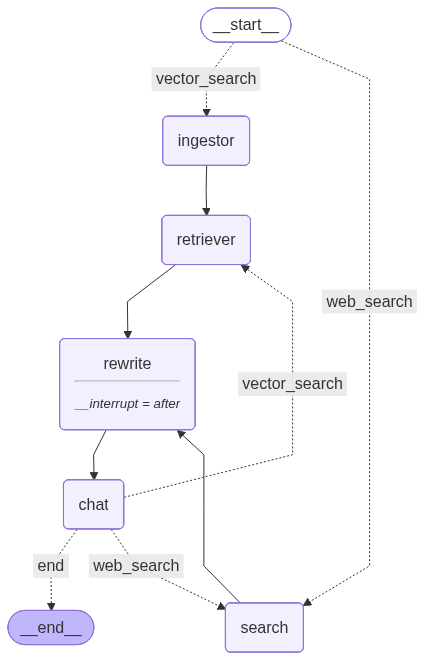

# Agentic Retrieval-Augmented Generation



## About

This is a graph-based RAG system for querying your PDFs or the web, with LLM-powered reasoning and a Streamlit UI. The system leverages LangGraph to create intelligent agents with tools that can process queries through a sophisticated workflow.

**LangGraph & Agent Architecture:**
- **LangGraph Framework**: Built on LangGraph for creating stateful, multi-step workflows with intelligent routing
- **Agent with Tools**: Implements a multi-agent system where different nodes handle specific tasks (ingestion, retrieval, search, rewriting)
- **Tool Integration**: Agents can use various tools including web search, document processing, and vector database operations
- **State Management**: Maintains conversation state and context across multiple interactions
- **Intelligent Routing**: Automatically routes queries to the appropriate processing nodes based on content and requirements

---

## Tech Stack & Tools

Python, LangGraph, LangChain, Gemini, Tavily Search, ChromaDB, Streamlit

---

## Quick Start

### Install dependencies
```bash
pip install -r requirements.txt
```

1. **Set up environment variables**
   - Create a `.env` file in the project root with:
           ```env
      # ChromaDB Cloud Configuration (Required)
      CHROMA_API_KEY="your_chroma_api_key_here"
      CHROMA_TENANT="your_tenant_id_here"
      CHROMA_DATABASE="your_database_name_here"
      
      # Existing API Keys
      GOOGLE_GENAI_API_KEYS="your_gemini_api_key1,your_gemini_api_key2"
      TAVILY_API_KEY="your_tavily_api_key"
      ```
2. **Run the Streamlit app**
   ```bash
   streamlit run streamlit_app.py
   ```
3. **Use the UI**
   - Upload PDF files and ask questions, or enable Web Search for open-domain queries.
   - View the agent's response and the reasoning graph.

---

## Project Structure

```
agentic-rag/
├── app.py                # (Entry point for API, if used)
├── streamlit_app.py      # Main Streamlit UI
├── graph.png             # Example graph visualization
├── requirements.txt      # Python dependencies
├── src/
│   ├── graphs/           # Graph builder and node logic
│   ├── utils/            # Data ingestion, embeddings, LLM runner, logger
│   ├── tools/            # Web search/crawl tools
│   ├── helpers/          # Helper functions and prompt templates
│   │   └── graph_operations.py  # Direct graph operation functions
│   ├── prompts/          # Prompt files
│   ├── data/             # VectorDB storage
│   ├── models.py, schemas.py
│   └── routers/          # (API routers, if extended)
└── test_graph.py         # Test script for the graph
```

---

## Configuration

- **Environment variables** (set in `.env`):
  - `CHROMA_API_KEY`: ChromaDB Cloud API key (required)
  - `CHROMA_TENANT`: ChromaDB Cloud tenant ID (required)
  - `CHROMA_DATABASE`: ChromaDB Cloud database name (required)
  - `GOOGLE_GENAI_API_KEYS`: Comma-separated Gemini API keys
  - `TAVILY_API_KEY`: Tavily web search API key

### Vector Database
- **ChromaDB Cloud**: Uses Chroma Cloud for vector storage and retrieval

## Architecture

The system can be run in two modes:

### Streamlit-Only Mode (Recommended for Hosting)
- **Direct Function Calls**: The Streamlit app now uses direct function calls instead of API requests
- **No API Server Required**: All graph operations are handled directly through helper functions
- **Easier Deployment**: Can be hosted on platforms like Streamlit Cloud without needing a separate API server

### API Mode (Optional)
The system also includes a FastAPI backend with the following endpoints:
- `POST /graph/start` - Start a new conversation thread
- `POST /graph/continue` - Continue an existing conversation
- `POST /graph/finish` - Finish a conversation session

---