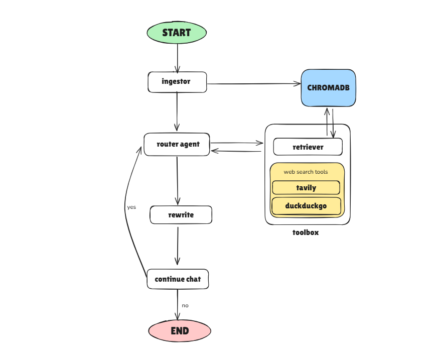

# Agentic Retrieval-Augmented Generation

🌐 **Live Demo**: [https://rag-reddybharat.streamlit.app/](https://rag-reddybharat.streamlit.app/)



## Node Descriptions

The system now follows a streamlined, agentic flow:

- **Ingestor Node**: If the user uploads PDF files, this node processes the documents, extracts text, and stores embeddings in the vector database (ChromaDB). If no files are uploaded, this step is skipped.
- **Router Agent Node**: The entry point for every user query. This is an agent node with access to both the vector database (for document retrieval) and web search tools (Tavily, DuckDuckGo, etc). It decides, for each query, how to combine document and web knowledge to generate the best possible answer.
- **Rewrite Node**: Takes the answer from the router agent and rewrites it for clarity, completeness, and presentability using LLM reasoning and formatting.
- **Chat Routing Node**: Determines whether the conversation should continue (awaiting further user input) or finish (ending the session).

## About

Agentic RAG is an interactive, graph-based Retrieval-Augmented Generation (RAG) system that lets you query your own PDFs or the web using a modern Streamlit UI. Powered by LLM reasoning, the system uses LangGraph to coordinate a set of intelligent agent nodes, each handling a specialized part of the workflow:

- **PDF & Web Q&A**: Upload PDF files and ask questions about your documents, or enable web search for open-domain queries.
- **Agentic Workflow**: A Router Agent Node autonomously decides how to combine document retrieval and web search tools (like Tavily, DuckDuckGo) to answer your query.
- **LLM-Powered Reasoning**: Answers are refined for clarity and completeness by a dedicated Rewrite Node using LLMs.
- **Conversation Memory**: Maintains context and state across multiple chat turns for a seamless experience.

---

## Tech Stack & Tools

Python, LangGraph, LangChain, Gemini LLM, Tavily Search, ChromaDB, Streamlit

---

## Quick Start

### Install dependencies
```bash
pip install -r requirements.txt
```

1. **Set up environment variables**
   - Create a `.env` file in the project root with:
      ```env
      # ChromaDB Cloud Configuration (Required)
      CHROMA_API_KEY="your_chroma_api_key_here"
      CHROMA_TENANT="your_tenant_id_here"
      CHROMA_DATABASE="your_database_name_here"
      
      # Existing API Keys
      GOOGLE_GENAI_API_KEYS="your_gemini_api_key1,your_gemini_api_key2"
      TAVILY_API_KEY="your_tavily_api_key"
      ```
2. **Run the Streamlit app**
   ```bash
   streamlit run streamlit_app.py
   ```
3. **Use the UI**
   - Upload PDF files and ask questions, or enable Web Search for open-domain queries.
   - View the agent's response and the reasoning graph.

---

## Project Structure

```
agentic-rag/
├── app.py                # FastAPI entry point
├── streamlit_app.py      # Main Streamlit UI
├── requirements.txt      # Python dependencies
├── src/
│   ├── graphs/           # Graph builder and node implementations
│   │   └── nodes/        # Individual node logic
│   ├── utils/            # Core utilities
│   ├── tools/            # External tool integrations
│   ├── helpers/          # Helper functions and templates
│   ├── data/             # VectorDB storage
│   └── routers/          # API endpoints
```

---

## Configuration

- **Environment variables** (set in `.env`):
  - `CHROMA_API_KEY`: ChromaDB Cloud API key (required)
  - `CHROMA_TENANT`: ChromaDB Cloud tenant ID (required)
  - `CHROMA_DATABASE`: ChromaDB Cloud database name (required)
  - `GOOGLE_GENAI_API_KEYS`: Comma-separated Gemini API keys
  - `TAVILY_API_KEY`: Tavily web search API key

### Vector Database
- **ChromaDB Cloud**: Uses Chroma Cloud for vector storage and retrieval

### APIs (Not implemented)
The system also includes a FastAPI backend with the following endpoints:
- `POST /graph/start` - Start a new conversation thread
- `POST /graph/continue` - Continue an existing conversation
- `POST /graph/finish` - Finish a conversation session

---